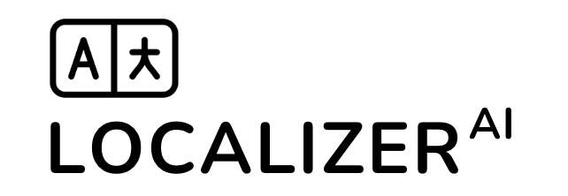

# Content Localizer CLI Documentation

<div align="center">



[](https://www.npmjs.com/package/localizer-ai)
[](https://opensource.org/licenses/MIT)
[](https://nodejs.org)
[](http://makeapullrequest.com)

A powerful CLI tool for automating content localization using AI, perfect for VitePress and similar documentation frameworks.

[Installation](#installation) •
[Documentation](#documentation) •
[Contributing](#contributing)

</div>

## Table of Contents

- [Features](#features)
- [Prerequisites](#prerequisites)
- [Installation](#installation)
- [Usage](#usage)
  - [Quick Start](#quick-start)
  - [Configuration](#configuration)
  - [Translation Context](#translation-context)
- [Architecture](#architecture)
- [Advanced Features](#advanced-features)
- [Contributing](#contributing)
- [API Documentation](#api-documentation)
- [Security](#security)
- [Roadmap](#roadmap)
- [License](#license)
- [Support](#support)

## Features

- 🤖 AI-powered translations using OpenAI GPT-4 or MistralAI
- 📁 Smart directory structure replication
- 🔄 Support for multiple file types (.md, .txt, .json)
- 🎯 Format preservation (markdown, special characters)
- 🚀 Parallel processing with rate limiting
- 📦 Perfect for VitePress projects
- 🌍 Context-aware translations

## Limitations

> ⚠️ **Early Stage Project**: This tool is in its early stages of development.

- **Markdown Formatting**: Some complex markdown structures may not be perfectly preserved during translation
- **Text File Formatting**: Special formatting in .txt files might require manual review
- **Work in Progress**: Active development is ongoing to improve formatting accuracy
- **Rate limiting**: You might hit the rate limit of the AI service you are using when using a free account.

These limitations are being actively addressed and will be improved in future versions. For best results, review translated output for critical content.

## Prerequisites

- Node.js >= 16.0.0
- npm or yarn
- OpenAI API key or MistralAI API key

## Installation

```bash
# Install globally
npm install -g localizer-ai

# Set up API key for OpenAI
npm config set -g openai-key YOUR_API_KEY

# Or set up API key for MistralAI
npm config set -g mistralai-key YOUR_API_KEY
```

## Usage

### Quick Start

1. Create a new configuration file:

```bash
localizer-ai create-config
```

2. Start the translation process:

```bash
localizer-ai translate
```

### Configuration

Create a `localizer-ai.config.json` file:

```json
{
  "source": "docs/en",
  "fileTypes": [".md", ".txt"],
  "locales": ["fr", "es", "de"],
  "from": "en",
  "destination": "localized",
  "aiServiceProvider": "openAI",
  "parallelProcessing": true,
  "llmConfig": {
    "temperature": 0.4,
    "maxTokens": 1000
  }
}
```

#### Configuration Options

| Option               | Description                | Default        |
| -------------------- | -------------------------- | -------------- |
| `source`             | Source directory path      | Required       |
| `fileTypes`          | Array of file extensions   | Required       |
| `locales`            | Target language codes      | Required       |
| `from`               | Source language code       | "en"           |
| `destination`        | Output directory           | Same as source |
| `aiServiceProvider`  | AI service to use          | "openAI"       |
| `parallelProcessing` | Enable parallel processing | true           |
| `llmConfig`          | AI model configuration     | {}             |

### Translation Context

#### File-level Context

```json
{
  "docs/api.md": "Technical API documentation",
  "docs/guide.md": "User guide content"
}
```

#### Deep Context (JSON files)

```json
{
  "docs/config.json": {
    "api.endpoints": "API endpoint descriptions",
    "$fileContext": "Configuration documentation"
  }
}
```

## Architecture

### Core Components

1. **CLI Interface** (`src/cli/commandExecutor.js`)

```javascript
async function commandExecutor() {
  displayWelcomeMessage();
  const args = process.argv.slice(2);
  // ... command handling logic
}
```

2. **Translation Engine** (`src/utils/textTranslator.js`)

```javascript
async function translateText({ content, from, to, localeContext, fileType }) {
  // ... translation logic
}
```

3. **File Processing** (`src/utils/fileReplicator.js`)

```javascript
async function replicateFiles(
  sourcePath,
  locales,
  fileTypes,
  from,
  destinationPath
) {
  // ... file replication logic
}
```

### AI Integration

#### OpenAI Implementation

```javascript
const askOpenAI = async ({ question, systemPrompt }) => {
  const response = await openai.chat.completions.create({
    model: "gpt-4",
    messages: [
      { role: "system", content: systemPrompt },
      { role: "user", content: question },
    ],
    temperature: 0.4,
    ...llmConfig,
  });
  return response.choices[0].message.content;
};
```

#### MistralAI Implementation

```javascript
const askMistralAI = async ({ question, systemPrompt }) => {
  const chatResponse = await client.chat.complete({
    model: "open-mistral-nemo",
    messages: [
      { role: "system", content: systemPrompt },
      { role: "user", content: question },
    ],
    ...llmConfig,
  });
  return chatResponse.choices[0].message.content;
};
```

## Advanced Features

### Format Preservation

The tool maintains formatting for:

#### Markdown

- Headers (h1-h6)
- Code blocks with language specification
- Lists (ordered and unordered)
- Links and images
- Bold and italic text
- Task lists
- Tables

#### JSON

- Nested structure preservation
- Type consistency
- Formatting maintenance

### Rate Limiting

```javascript
class AIRequestQueue {
  constructor(delayMs = 1500) {
    this.queue = [];
    this.isProcessing = false;
    this.delayMs = delayMs;
  }

  async processQueue() {
    // ... queue processing logic with rate limiting
  }
}
```

## Contributing

1. Fork the repository
2. Create your feature branch:

```bash
git checkout -b feature/AmazingFeature
```

3. Install dependencies:

```bash
npm install
```

4. Run in development mode:

```bash
npm run dev
```

5. Commit your changes:

```bash
git commit -m 'Add some AmazingFeature'
```

6. Push to the branch:

```bash
git push origin feature/AmazingFeature
```

7. Open a Pull Request

### Development Guidelines

1. **Code Style**

- Use ESLint configuration
- Follow JSDoc documentation standards
- Maintain test coverage

2. **Commit Messages**

- Use conventional commits format
- Include issue references

3. **Testing**

```bash
npm test
```

## API Documentation

### Core Functions

#### translateText

```javascript
/**
 * Translates content from one language to another
 * @param {Object} options Translation options
 * @param {string} options.content Content to translate
 * @param {string} options.from Source language
 * @param {string} options.to Target language
 * @returns {Promise<string>} Translated content
 */
async function translateText(options) {
  // Implementation
}
```

#### replicateFiles

```javascript
/**
 * Replicates directory structure with translations
 * @param {string} sourcePath Source directory
 * @param {string[]} locales Target locales
 * @param {string[]} fileTypes File types to process
 * @returns {Promise<void>}
 */
async function replicateFiles(sourcePath, locales, fileTypes) {
  // Implementation
}
```

## Security

- API keys stored securely using npm config
- Rate limiting for API calls
- Input validation for file operations
- Safe file system operations

## Roadmap

- [ ] Add support for more AI providers
- [ ] Implement translation memory
- [ ] Add custom translation rules
- [ ] Support for more file formats
- [ ] Batch processing optimization
- [ ] Auto language detection
- [ ] Translation quality metrics

## License

This project is licensed under the MIT License - see the [LICENSE](LICENSE) file for details.

## Support

- Create an [issue](https://github.com/TakasiVenkataSandeep-08/localizer-AI/issues)
- Star the project
- Follow updates

## Credits

Created by [Takasi Venkata Sandeep](https://github.com/TakasiVenkataSandeep-08)

## Related Projects

- [VitePress](https://vitepress.dev/)
- [OpenAI GPT-4](https://openai.com/gpt-4)
- [MistralAI](https://mistral.ai/)
